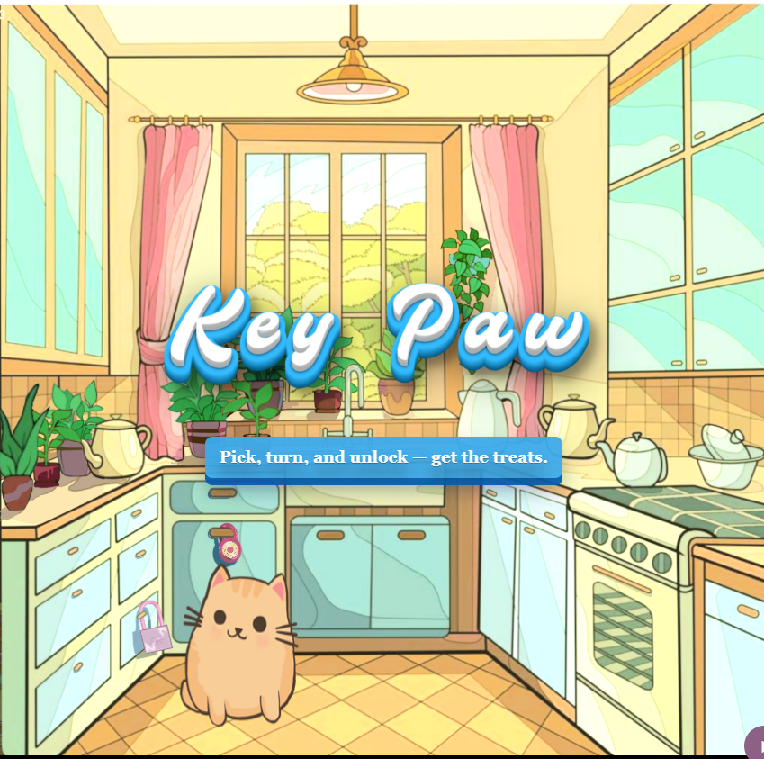

# KeyPaw — Frontend (FEKeyMaster)

KeyPaw is a browser-based, image-driven lock‑picking puzzle game. This frontend is built with React + Vite and demonstrates interactive UI, responsive image-driven layout, audio feedback, optimistic UI patterns, and JWT-backed authentication.

<p align="center">
	
</p>

Quick overview

- Tech: React (Vite), JavaScript (JSX), plain CSS, Web Audio API
- Demonstrates: responsive artwork-driven layout, stateful puzzle components, optimistic updates, and secure API integration using JWT

- Real-world app architecture: client + API + relational DB with authentication
- Attention to UX: instant feedback (optimistic UI), accessible overlays, and small micro-interactions (unlock treat)
- Deploy-ready: Vite build, Netlify-friendly configuration, and environment-driven API base URL

Getting started (development)

Prereqs

- Node.js 18+ and npm
- A running PostgreSQL (local) or remote DB (Railway, Supabase)

Run locally

1. Start the backend (BEKeyMaster) and seed demo data (only on local/dev):

```bash
cd BEKeyMaster
npm ci
# create .env with DATABASE_URL, JWT_SECRET, CLIENT_ORIGIN
node db/seed.js   # WARNING: this deletes and recreates demo puzzles
npm run dev
```

2. Start the frontend

```bash
cd FEKeyMaster
npm ci
# set VITE_API_URL in FEKeyMaster/.env if different than default
npm run dev
```

Open the site at the Vite dev server URL (usually http://localhost:5173). The frontend reads `VITE_API_URL` for the API base; it falls back to `http://localhost:3001` if unset.

**Note:** Demo mode uses client-side validation for preview purposes.

Demo & screenshots

Include screenshots and a short GIF to help reviewers quickly understand the product. Suggested assets (place under `FEKeyMaster/docs/images/`):

- `hero-play.png` — wide hero image (1200×600) showing game landing or Play page
- `gameboard.png` — gameplay screenshot showing a lock (960×640)
- `unlock.gif` — short 1–2s GIF showing an unlock animation and overlay treat (400–800px wide)

Insert images in this README where you see the placeholder line above. Example markdown to embed a screenshot:

```md


```

What to look for in the code (for technical reviewers)

- Component layout: `src/components/*` (PinTumbler, DialLock)
- State + context: `src/context/*` (AuthContext, PuzzleContext)
- API client: `src/lib/api.js` (reads `import.meta.env.VITE_API_URL`)
- UX details: `src/styles/*` and `src/components/OverlayMessage.jsx` (treat SVG & micro animations)

Deployment notes

- There is a `FEKeyMaster/netlify.toml` for Netlify builds; set `VITE_API_URL` in Netlify environment variables for production.

Security & production notes

- Do NOT run `node db/seed.js` against a production DB — it deletes puzzles.
- Keep `JWT_SECRET` private and use HTTPS for production deployments.

Contributing

- Create a branch, run `npm ci` in `FEKeyMaster`, and open a PR with screenshots or short GIFs for visual changes.

License

This project is MIT licensed — see `../BEKeyMaster/LICENSE`.

Contact

Open an issue or PR in this repository for questions or suggested improvements.
